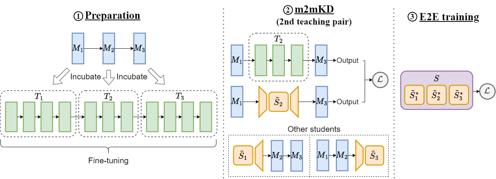

# m2mKD

This repository contains the source code for [m2mKD: Module-to-Module Knowledge Distillation for Modular Transformers](https://arxiv.org/abs/2402.16918).

## Overview

We propose a general module-to-module knowledge distillation (m2mKD) method for transferring knowledge between modules. Our approach involves teacher modules split from a pretrained monolithic model, and student modules of a modular model. m2mKD separately combines these modules with a shared meta model and encourages the student module to mimic the behavior of the teacher module. By applying m2mKD to [NAC](https://proceedings.neurips.cc/paper_files/paper/2022/file/32f227c41a0b4e36f65bebb4aeda94a2-Paper-Conference.pdf) and [V-MoE](https://proceedings.neurips.cc/paper/2021/file/48237d9f2dea8c74c2a72126cf63d933-Paper.pdf) models, we achieve improvements in both IID accuracy and OOD robustness.



## Setup

Setup the environment as follows: 

```bash
git clone https://github.com/kamanphoebe/m2mKD.git
cd m2mKD
conda create -n m2mkd python=3.11
conda activate m2mkd
pip install -r requirements.txt

# fastmoe
git clone https://github.com/laekov/fastmoe.git
cd fastmoe 
python setup.py install
cd ..

# speedrun (use the dev branch)
git clone https://github.com/inferno-pytorch/speedrun.git
cd speedrun
git checkout dev
python setup.py install

# Add paths to environment variables.
export PYTHONPATH="$PWD/deep_incubation:$PWD/nacs:$PYTHONPATH"
```

## Usage

Our experiments are conducted on NAC and V-MoE models. The instructions for training these models can be found in [TRAIN-NAC.md](./TRAIN-NAC.md) and [TRAIN-MOE.md](./TRAIN-MOE.md), respectively. 

If you are interested in trying out m2mKD quickly on NACs, you can utilize our released checkpoints of either the teacher modules or the student modules. See [TRAIN-NAC.md](./TRAIN-NAC.md) for details.

## Released checkpoints

The model checkpoints are available at [Hugging Face](https://huggingface.co/kamanphoebe/m2mKD), including:
- `nac_scale_tinyimnet.pth`/`nac_scale_imnet.pth`: NAC model with a scale-free prior trained using m2mKD.
- `vmoe_base.pth`: V-MoE-Base model trained using m2mKD.
- `FT_huge`: a directory containing DeiT-Huge teacher modules for NAC model training.
- `nac_tinyimnet_students`: a directory containing NAC student modules for Tiny-ImageNet.

## Acknowledgement

Our implementation is mainly based on [Deep-Incubation](https://github.com/LeapLabTHU/Deep-Incubation). 

## Citation

If you use the code, please cite our paper:
```
@misc{lo2024m2mkd,
    title={m2mKD: Module-to-Module Knowledge Distillation for Modular Transformers}, 
    author={Ka Man Lo and Yiming Liang and Wenyu Du and Yuantao Fan and Zili Wang and Wenhao Huang and Lei Ma and Jie Fu},
    year={2024},
    eprint={2402.16918},
    archivePrefix={arXiv},
    primaryClass={cs.LG}
}
```